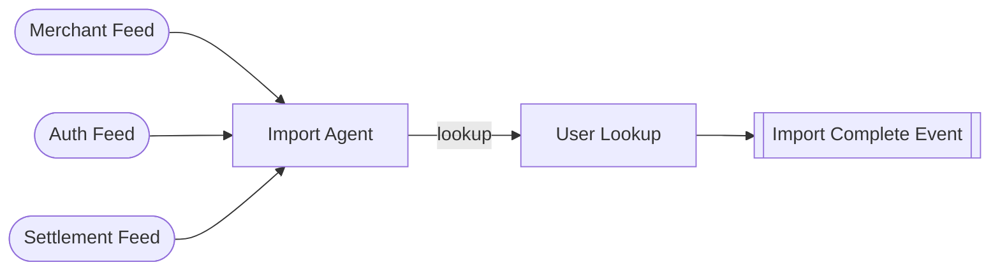
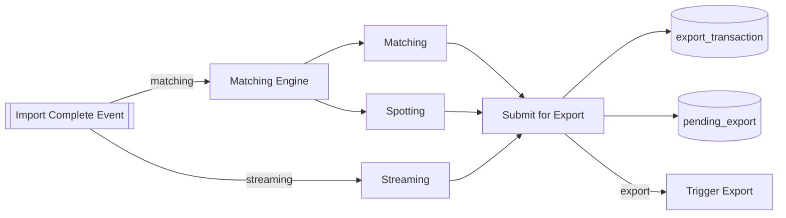
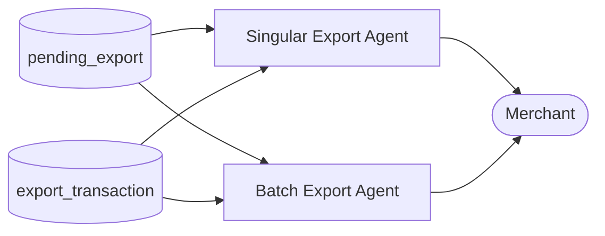

# Harmonia Data Flow

## Import

```mermaid
flowchart LR
    import_complete[[Import Complete Event]]
    merchant([Merchant Feed])
    auth([Auth Feed])
    settlement([Settlement Feed])

    import_agent["Import Agent"]
    user_lookup["User Lookup"]

    merchant --> import_agent
    auth --> import_agent
    settlement --> import_agent
    import_agent -- lookup --> user_lookup
    user_lookup --> import_complete
```

## Process

```mermaid
flowchart LR
    import_complete[[Import Complete Event]]
    export_transaction[(export_transaction)]
    pending_export[(pending_export)]

    matching_engine["Matching Engine"]
    submit_export["Submit for Export"]
    trigger_export["Trigger Export"]

    import_complete -- matching --> matching_engine
    matching_engine --> Matching --> submit_export
    matching_engine --> Spotting --> submit_export
    import_complete -- streaming --> Streaming --> submit_export
    submit_export --> export_transaction
    submit_export --> pending_export
    submit_export -- export --> trigger_export
```

## Export

```mermaid
flowchart LR
    merchant([Merchant])
    pending_export[(pending_export)]
    export_transaction[(export_transaction)]

    singular_export["Singular Export Agent"]
    batch_export["Batch Export Agent"]

    pending_export --> singular_export
    pending_export --> batch_export
    export_transaction --> singular_export
    export_transaction --> batch_export
    singular_export --> merchant
    batch_export --> merchant
```
