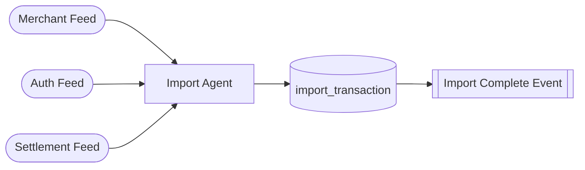
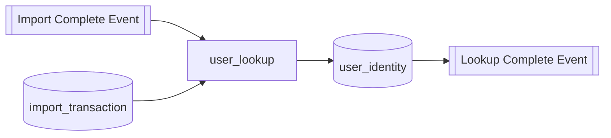
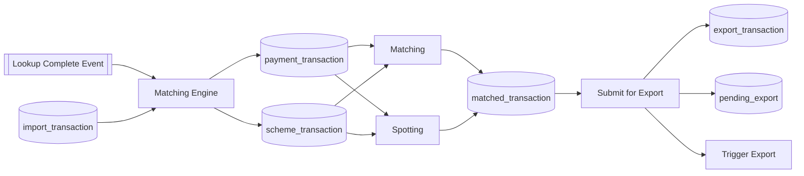
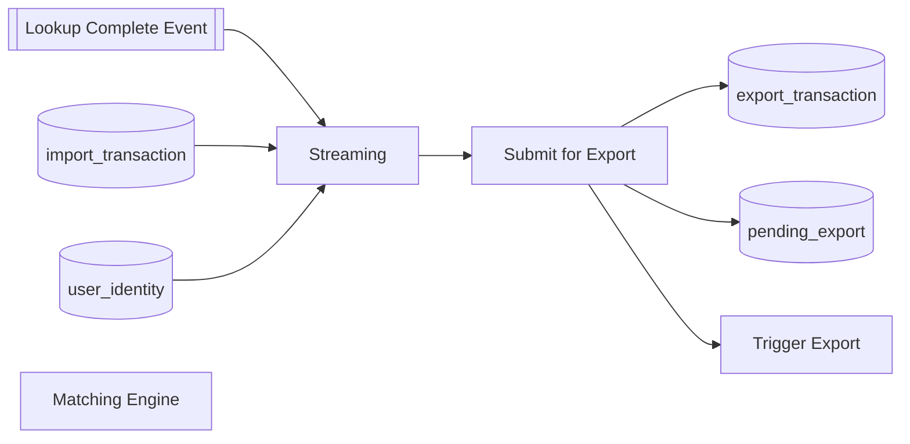

# Harmonia Data Flow

## Import

```mermaid
flowchart LR
    merchant([Merchant Feed])
    auth([Auth Feed])
    settlement([Settlement Feed])
    import_complete[[Import Complete Event]]
    import_transaction[(import_transaction)]

    import_agent["Import Agent"]

    merchant --> import_agent
    auth --> import_agent
    settlement --> import_agent

    import_agent --> import_transaction --> import_complete
```

## User Lookup

```mermaid
flowchart LR
    import_complete[[Import Complete Event]]
    lookup_complete[[Lookup Complete Event]]
    import_transaction[(import_transaction)]
    user_identity[(user_identity)]

    import_complete --> user_lookup
    import_transaction --> user_lookup
    user_lookup --> user_identity --> lookup_complete
```

## Matching

```mermaid
flowchart LR
    lookup_complete[[Lookup Complete Event]]

    import_transaction[(import_transaction)]
    payment_transaction[(payment_transaction)]
    scheme_transaction[(scheme_transaction)]
    matched_transaction[(matched_transaction)]
    export_transaction[(export_transaction)]
    pending_export[(pending_export)]

    matching_engine["Matching Engine"]
    submit_export["Submit for Export"]
    trigger_export["Trigger Export"]

    lookup_complete --> matching_engine
    import_transaction --> matching_engine

    matching_engine --> payment_transaction
    matching_engine --> scheme_transaction

    payment_transaction --> Matching
    scheme_transaction --> Matching
    payment_transaction --> Spotting
    scheme_transaction --> Spotting

    Matching --> matched_transaction
    Spotting --> matched_transaction

    matched_transaction --> submit_export

    submit_export --> export_transaction
    submit_export --> pending_export
    submit_export --> trigger_export
```

## Streaming

```mermaid
flowchart LR
    lookup_complete[[Lookup Complete Event]]

    import_transaction[(import_transaction)]
    user_identity[(user_identity)]
    export_transaction[(export_transaction)]
    pending_export[(pending_export)]

    matching_engine["Matching Engine"]
    submit_export["Submit for Export"]
    trigger_export["Trigger Export"]

    lookup_complete --> Streaming
    import_transaction --> Streaming
    user_identity --> Streaming

    Streaming --> submit_export

    submit_export --> export_transaction
    submit_export --> pending_export
    submit_export --> trigger_export
```

## Export

```mermaid
flowchart LR
    merchant([Merchant])
    pending_export[(pending_export)]
    export_transaction[(export_transaction)]

    singular_export["Singular Export Agent"]
    batch_export["Batch Export Agent"]

    pending_export --> singular_export
    pending_export --> batch_export
    export_transaction --> singular_export
    export_transaction --> batch_export
    singular_export --> merchant
    batch_export --> merchant
```
